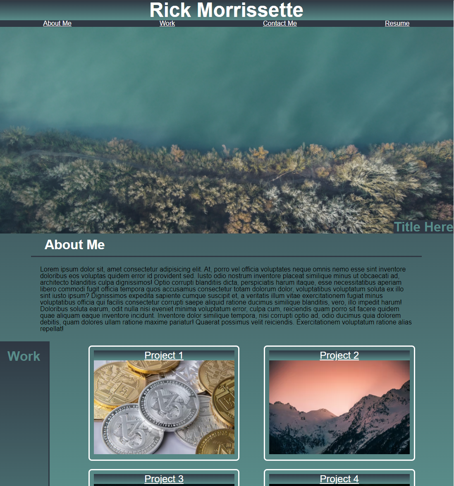

Created a basic developer portfolio with styling. Used flexbox to organize elements as well as media queries for screen size adjustments.

[Link to final project webpage](https://confusedicarus.github.io/02-css-developer-portfolio/)
